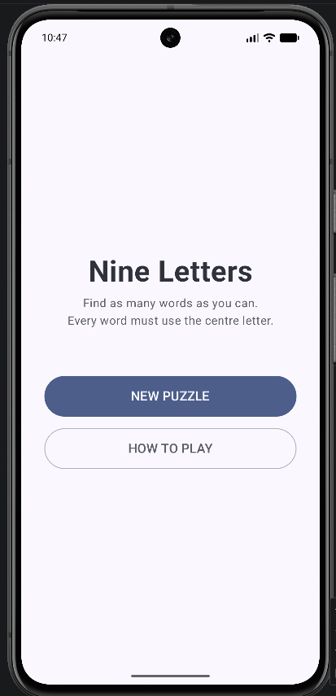
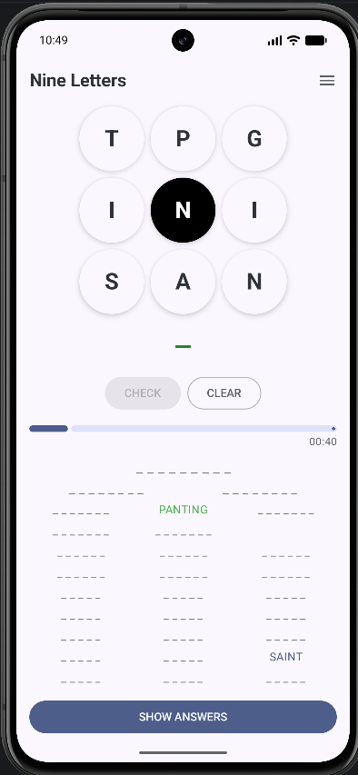
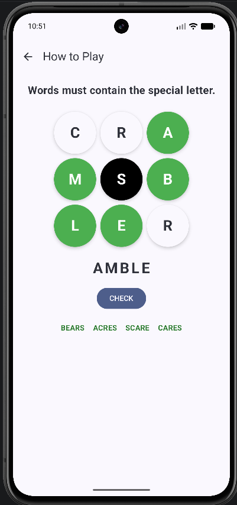
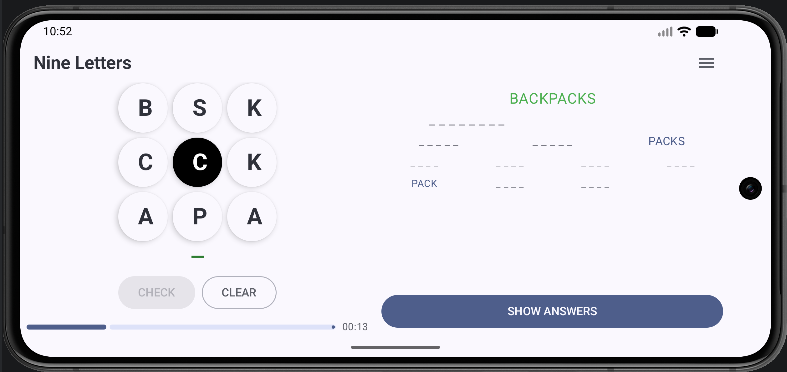
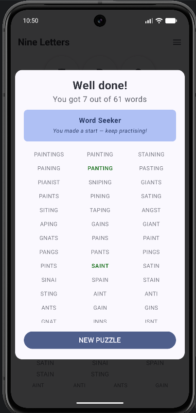

# Nine Letters

A native Android word puzzle game built with Kotlin and Jetpack Compose.

Given nine letters arranged in a 3×3 grid, find as many words as you can — every word must include the centre letter, and be at least four letters long. Try to find the nine-letter word that uses every tile.

---

## Screenshots

| Home | Puzzle (Portrait) | Help |
|------|-------------------|------|
|  |  |  |

| Puzzle (Landscape) | Answers Revealed |
|--------------------|------------------|
|  |  |

---

## How to Play

1. **Select letters** by tapping tiles individually, or swipe across the grid to build a word in one gesture.
2. Tap a selected tile again (or swipe back over it) to remove that letter from your guess.
3. Press **CHECK** to submit your word, or **CLEAR** to start over.
4. Every valid word must:
   - Be **at least 4 letters** long.
   - Contain the **centre letter** (shown in black).
   - Be a real word — plurals of valid words are not accepted.
5. Find the **nine-letter word** that uses every tile to complete the puzzle.

---

## Features

- **Tap or swipe** to select letters — build words naturally with either gesture.
- **Portrait and landscape** layouts — the grid shifts left and the word list moves right in landscape.
- **Grouped word list** — answers are shown by length (9-letter words full-width, down to 4-letter words in four columns).
- **Auto-scroll** — the word list scrolls to highlight each newly found word in green.
- **Progress bar** — shows how many answers have been found.
- **Assist options** available from the hamburger menu:

| Option | Default | Description |
|--------|---------|-------------|
| Clue | Off | Shows a short hint about the nine-letter word |
| Show Blanks | On | Displays `_ _ _ _` slots for undiscovered words |
| Show First Letter | Off | Reveals the first letter of each undiscovered word |
| Timer | On | Shows elapsed time since the puzzle was loaded |
| Sound on Solve | On | Plays a tone when a word is found |

- **New Random Puzzle** and **Main Menu** accessible from the same menu.
- **Show Answers** button reveals all remaining words and stops the timer.
- **Interactive tutorial** — the Help screen animates a live demo of the rules before letting you practice.

---

## Adding Puzzles

Puzzles live in [`app/src/main/assets/puzzles.txt`](app/src/main/assets/puzzles.txt). Each line follows the format:

```
WORD|Short clue describing the word
```

Rules:
- The word must be **exactly 9 letters** and contain only letters.
- The **centre letter is chosen randomly** each time the puzzle is played — no need to specify it.
- Lines starting with `#` are treated as comments.

Example:

```
CHOCOLATE|Sweet cocoa treat
ADVENTURE|Exciting experience
CARPENTER|A craftsperson who works with wood
```

---

## Project Structure

```
app/src/main/
├── assets/
│   ├── dictionary.txt       # Word list (one word per line, 4+ letters)
│   └── puzzles.txt          # Puzzle definitions (word|clue)
└── java/com/au/lightlytwisted/nineletters/
    ├── MainActivity.kt      # Navigation, PuzzleScreen UI, HelpScreen
    ├── PuzzleViewModel.kt   # All game state and logic (StateFlow)
    ├── PuzzleData.kt        # Puzzle data class and puzzles.txt parser
    ├── Dictionary.kt        # Trie-based dictionary and anagram solver
    └── ui/theme/            # Material3 theme
```

---

## Building

1. Open the project in Android Studio.
2. Build output is redirected to `F:/NineLettersBuild` to avoid OneDrive file-locking issues — see `gradle.properties` if you need to adjust this path.
3. Run on a device or emulator (API 26+).

---

## Tech Stack

- **Language:** Kotlin
- **UI:** Jetpack Compose with Material3
- **Architecture:** ViewModel + StateFlow (MVVM)
- **Navigation:** Navigation Compose
- **Dictionary:** Custom Trie with anagram solver
- **Minimum SDK:** 26 (Android 8.0)

---

*Originally based on a 2015 web word puzzle. Revived as a native Android app in 2026.*
